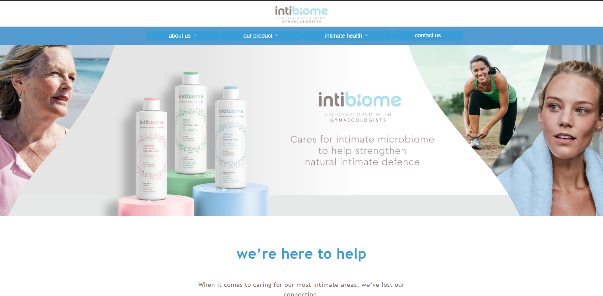

<p align="center">
  
</p>

<br />

<br />

O projeto foi feito durante um teste proposto por “The Brooklin Brother”, que consiste em criar uma landing page para apresentação do produto “intibiome”. Foi utilizado as melhores práticas e tecnologias disponíveis no mundo da tecnologia para a realização deste projeto. 

<br />

Utilizando como base o conceito de componentização e reutilização de código, somados ao conceito de “Atomic Design”, que consiste em diminuir, até a menor “partícula” dos elementos em tela. 

<br />

Apesar de ter sido feito todo em ReactJs, identifiquei que, caso o projeto fosse ao ar, seria necessário corrigir a implementação e/ou melhorias nas animações presentes, além de utilizar alguma tecnologia para implementação de SEO, para localização pelos sites de buscas.

<br />

## **💻** Projeto

 <p align="center">
  
</p>


## Tecnologias utilizadas

- [Typescript](https://www.typescriptlang.org/)
- [ReactJS](https://pt-br.reactjs.org/)
- [CSS5](https://developer.mozilla.org/pt-BR/docs/Web/CSS)
- [Radix-UI](https://www.radix-ui.com/docs/primitives/components/navigation-menu)
- [vite](https://vitejs.dev/)


## **🔖 Layouts**

Você pode visualizar o layout fornecido, basta acessar o link abaixo:

- [Adobe XD](https://xd.adobe.com/view/ee2360fe-f631-4fba-be92-abc81b8aa2b2-bb70/screen/ee56b07a-8780-4a05-b239-f1107406c1cd/specs/)

<br/>

## **🚀** Como Executar

Para clonar esta aplicação e rodar em sua máquina, será necessário possuir [Git](https://git-scm.com). Para execução, é necessário, também, o [NodeJS](https://nodejs.org/)

```bash
## Clone o projeto em sua máquina
git clone https://github.com/srsouzaj/lp-the-brooklin.git

# Acessar o projeto no terminal
$ cd lp-the-brooklin

# Instalar as dependências
$ npm install

# Executar o servidor em modo de desenvolvimento;
$ npm run dev
```

## 📝 License

Esse projeto está sob a licença MIT. Veja o arquivo [LICENSE](https://github.com/srsouzaj/lp-the-brooklin/blob/master/License.md) para mais detalhes.

Feito com ❤️ por Jorge de Souza
